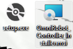
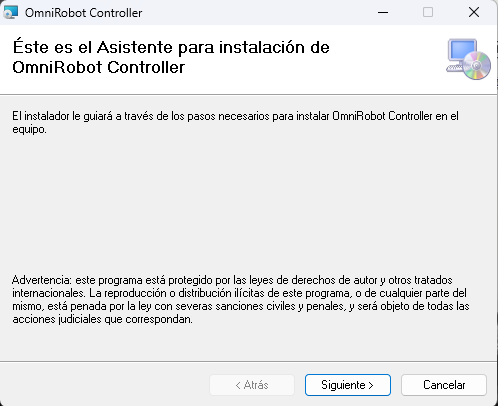
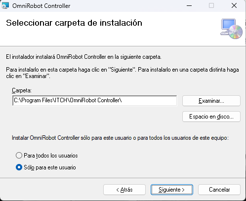
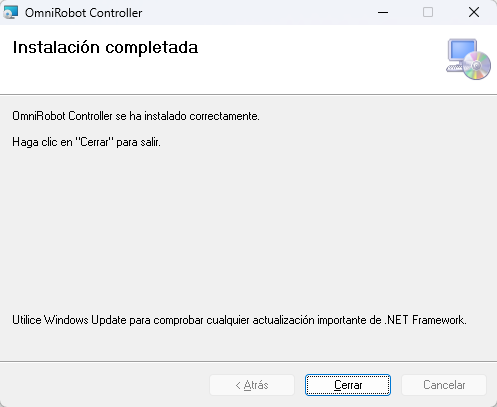
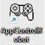

# Remote Control Omnidirectional Robot

Este repositorio contiene los códigos y proyectos necesarios para el control de los motores y la cámara de un robot ArmPi Pro.
Está organizado en varias carpetas las cuales albergan los distintos archivos.

## Estructura del Repositorio

El repositorio está estructurado en las siguientes carpetas principales:

### 1. `AppControlRobot` (Aplicación e Instalador)

Esta carpeta contiene todos los archivos relacionados con el proyecto de Visual Studio. Dentro de esta carpeta, encontrarás dos subcarpetas importantes:

- **`AppControlRobot`**: Contiene los códigos y recursos gráficos para la interfaz gráfica de control.
- **`OmniRobot_Controller_Installer`**: Incluye el instalador del proyecto. Dentro de esta carpeta, hay una subcarpeta llamada `Debug` que contiene el archivo Setup.exe (instalador) y OmniRobot_Controller_Installer.msi disponibles para su descarga.

### 2. `PS4controller`

Esta carpeta contiene una aplicación desarrollada en Visual Studio para verificar el correcto funcionamiento del control. Es útil si se ha conectado un control de PS4, en cuyo caso se recomienda utilizar esta aplicación para pruebas.

### 3. `PythonScripts`

Aquí se encuentran los códigos principales implementados en Ubuntu en la Raspberry Pi. Los scripts presentes son:

- **`CameraInterface_2.py`**: Código del sistema de detección de colores y su servidor dedicado.
- **`main_control_vs.py`**: Código del servidor que recibe todas las instrucciones para el manejo de los motores y servomotores del robot.
- **`vs_control_robot.py`**: Recibe instrucciones del `main_control_vs.py` y se encarga del manejo de los motores de corriente continua (DC) de las ruedas.
- **`vs_control_servo.py`**: Similar al anterior, pero maneja el control de los servomotores del brazo robótico.

## Proceso de Instalación

Para instalar la aplicación, sigue estos pasos:

1. **Navega al Repositorio**: Dirígete a la carpeta del instalador en el repositorio. Puedes encontrar la ruta desde la carpeta raíz del repositorio en:
   
Enlace directo al instalador:
[OmniRobot_Controller_Installer/Debug](https://github.com/AlejandroMoHo/Remote_control_omnidirectional_robot/tree/main/AppControlRobot/OmniRobot_Controller_Installer/Debug)

2. **Descarga los Archivos**: Dentro de la carpeta `Debug`, encontrarás dos archivos necesarios para la instalación: `OmniRobot_Controller_Installer.msi` y `setup.exe`. Es recomendable descargar ambos archivos.

3. **Ejecuta el Instalador**: Abre el archivo `setup.exe` o `OmniRobot_Controller_Installer.msi` para iniciar el asistente de instalación.

4. **Proceso de Instalación**:
- Al abrir el instalador, sigue las instrucciones del asistente.
- Presiona “Siguiente” para seleccionar la carpeta de instalación.
- Elige si deseas instalar el programa para todos los usuarios o solo para el usuario actual.

5. **Finaliza la Instalación**: Continúa pulsando “Siguiente” hasta que el programa se haya instalado. Cuando el asistente indique que la instalación se ha completado, puedes pulsar “Cerrar”.

6. **Verifica la Instalación**: Busca el ícono del programa en el escritorio o ábrelo directamente. Asegúrate de conectar un control antes de abrir la aplicación.

---

Si tienes alguna pregunta o necesitas más información, no dudes en contactar al mantenedor del proyecto.
